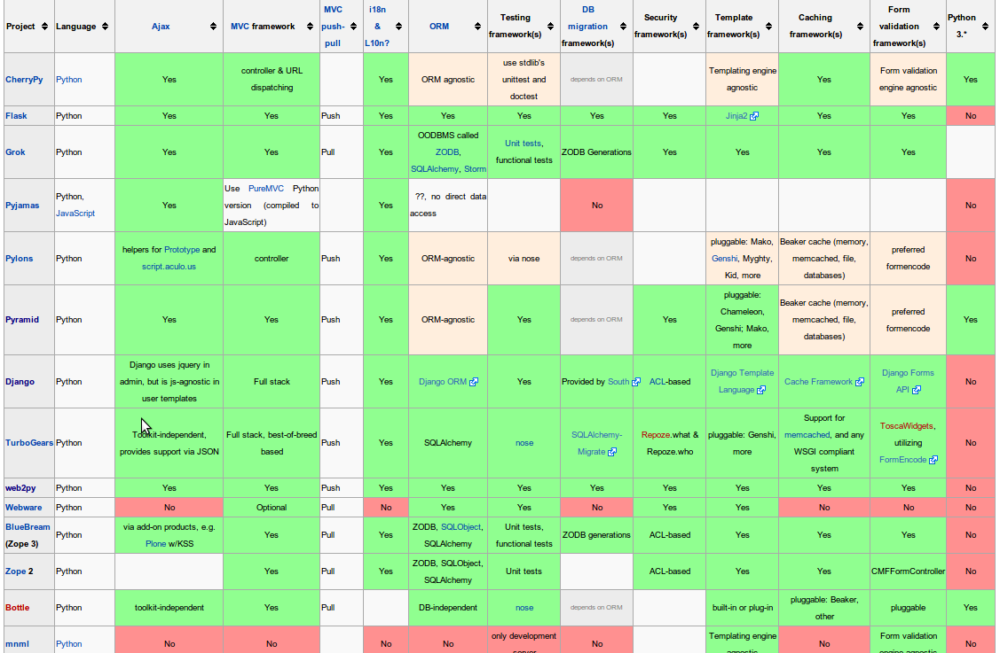
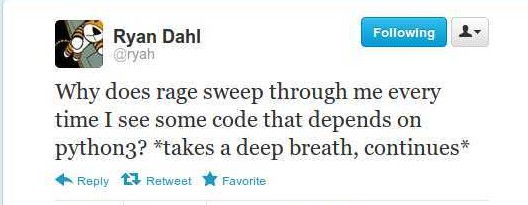

Python and Web
==============

----

Welcome
=======

Thanks for coming to PyCon Apac 2012.

    - **Senthil Kumaran** 
    - *Python Core Developer*
    - *Engineer at Lucasfilm, Singapore*.

.. image:: senthil_qr2.png

---- 

Why this talk
=============

* Singapore has a web-dev mindshare
* RoR, Python, JS and Databases (Though they call it as Big Data).
* I feel it is skewed towards specific technologies.
* A wider understanding may help us more.

---- 

Presentation
============

..qr: http://uthcode.googlecode.com/svn/trunk/presentations/pyconapac12/pythonweb/presentation.html

----

It's not a comparision
======================

* It is some sort of general survey.
* All frameworks share some commonality above a certain level.
* We will look at Basic Differences.
* We will look at State of affairs in their world.

---- 

Technical Differences
=====================

* http://en.wikipedia.org/wiki/Comparison_of_web_application_frameworks#Python_2

---- 

Chart
=====

---- 

What shall we look for
======================

* Technology - How is the progress
* Ecosystem 
* Community

Presenter Notes 
--------------- 

Technology means how the progress with new features and bug fixes. Ecosystem
involves other dependent libraries and their progress. Community aspects
involve adoption, participation and mindshare.

CPython
=======

* 3.3 Release is on the horizon.
* Many new features in the language and standard library.
* ipaddr module and multiple bug fixes Internet protocol libraries.
* **Web Frameworks Moving towards Python3**
* PEP 3333 Adoption has been good.

----

Python 3
========

---- 

Well, you should look at
========================

* Pyramid
* Django
* Twisted, Tornado
* SciPy and NumPy
* Python 3 stdlib.

---- 

Thinking of Web
===============

* Django, Pylons, Pyramid, Web2py
* Flask 
* Twisted, Tornado
* Python ORMs - SqlAlchemy.

---- 

Django
======

* Reusability and Pluggability
* Admin Interface is still a **Big Win**.

Presenter Notes 
---------------

* Project started in 2005
* Current Stable release is 1.4
* Django Software Foundation and DjangoCon

----

Companies
=========

* Pinterest
* Instagram
* Disqus
* PBS

Presenter Notes 
--------------- 

Give details.

----

Pinterest
=========

*We use python + heavily-modified Django at the application layer.  Tornado and
(very selectively) node.js as web-servers.  Memcached and membase / redis for
object- and logical-caching, respectively.  RabbitMQ as a message queue.
Nginx, HAproxy and Varnish for static-delivery and load-balancing.  Persistent
data storage using MySQL.  MrJob on EMR for map-reduce.*

    - Pinterest Founder at Quora

---- 

Instagram
=========

* Django gunicorn.org as WSGI server.
* Deploying code - we use Fabric.
* Postgresql
* Push Notification - pyapns - Twisted service.
* Python-munin - metrics
* Django Sentry - Error Logging.

From Instagram Blog.

---- 

Django Community
================

* Huge and Vibrant.
* Bi Yearly Django Con. (One in Progress)

---- 

Django and Python 3
===================

* Move towards Python 2.6 and to Python 3.
* Use compatiblity layer and migration path.
* Fear is for the size of the community and not technical details

https://www.djangoproject.com/weblog/2012/mar/13/py3k/

---- 

Pyramid
=======

* Framework Inspired by Zope, Pylons and Django
* Minimalist Framework, resues existing components from Community
* "pay only for what you eat"
* SQL and NoSQL 

---- 

What's New
==========

* Pyramid 1.3 has Python 3 support. **Yay!**
* https://github.com/Pylons/pyramid/wiki/Python-3-Porting
* Pretty Good that they are able to have Python2/Python3 compatiblity layer. It is a single software which runs under both.

---- 

Companies
=========

* Dropbox
* Reddit
* Digg

---- 

Reddit
======

* Moved from Lisp to Python, because they wanted "Batteries Included".
* https://github.com/reddit/
* The whole site is a webapp. The framework they use is a big deal.

---- 

DropBox
=======

* 99.9 % of their code is in Python. Used on the server backend; desktop
  client, website controller logic, API backend, and analytics.
* Runs on a single code base using Python.
* Pylons/Pyramid as the Web App.

---- 

Community
=========

* https://github.com/Pylons
* 66 repos and 38 members.
* Lots of Activity.
* No specific conference, but US PyCon.

---- 

Pyramid and Python 3
====================

.. image:: python-3.png
   :align: center

---- 

Web2Py
======

* Web Based IDE
* Default Templating
* Automatic Ticketing System
* Automatic Admin Interface

---- 

InfoWorld's Tech Award
======================

Web2py installs everything you need -- even a Python interpreter -- for
building a Python-based Web application. Its creator's mission to build an
easy-to-use framework extends throughout. Web2py's database abstraction layer
allows you to manipulate a variety of databases without having to write any
SQL. Once you've defined your database tables, Web2py will automatically build
an administration interface for your app. In fact, Web2py's combination console
and dashboard is where all your application development activities take place
-- even editing your application files. Finally, Web2py lets you embed Python
code into your Web page's HTML, so you don't have to learn a new template
language. With all its built-in assistance, Web2py is as painless as it gets.

    -- `Rick Grehan`

.. _Rick Grehan: http://www.infoworld.com/slideshow/24605/infoworlds-2012-technology-of-the-year-award-winners-183313#slide23

---- 

Powered by Web2py
=================

* http://web2py.com/poweredby
* http://apac.pycon.org

Community
=========

* https://github.com/mdipierro/web2py
* Python3 not yet, but are ready to move soon.

---- 

Twisted
=======

* Event driven networking engine written in Python. Supports many protocol and you can define your own custom protocol.
* In Web, used as Abstraction layer.
* Inteface to web servers.
* Interface to Database as a Proxy and Connection Manager to the Pool
* Lots of Companies use it, both internally and Externally.
* Lucasfilm, Ubuntu, TweetDeck etc. 

---- 

What New in Twisted
===================

* Twisted 12.0
* Primary Support for IPv6 on Server Side.
* Numerous Bug Fixes.
* Active Community at TwistedMatrix.com
* Python 3 support is available in a branch and work in progress.

----

Tornado
=======

* New Addition to Web Python Eco System.
* Scalable, non-blocking HTTP Server and inclined towards Speed.
* FriendFeed and Facebook
* https://github.com/facebook/tornado
* Sites like Hipmunk.com and Quora are using Tornado

---- 

What's New
==========

* Tornado runs on Python 2.5, 2.6, 2.7 and 3.2.

---- 

Client Side
===========

* Requests
* Requests Making Rapid adoption in many frameworks.
* urllib
* Improvements in progress in Python 3 with Multiple Bug Fixes.
* Plenty of Other Libraries.

----

On the whole
============

* Python on the Web Eco System is Vibrant.
* Lots of technologies Involved.
* Despite differences, there is a commonality in approaches.
* Like MVC architecture, WSGI Support and Playing well with other libraries.
* Easy to do, because it is Python.

----

Thank you!
==========

