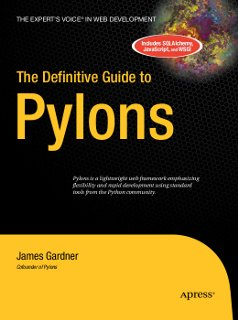

.. -*- coding: utf-8 -*-
.. include:: <s5defs.txt>
.. |==>| unicode:: U+02794 .. thick rightwards arrow

======
Pylons 
======

.. class:: center

   | Web Development using Pylons
   | Singapore Python Users Group - Jan 2012

.. class:: right small

   | - Senthil Kumaran

.. container:: handout

    This presentation gives an overview of Pylons web development framework.

.. contents::
   :class: handout

.. footer:: 
    http://www.uthcode.com

Pylons
======

A pylon is a monumental portal to an ancient Egyptian temple.

.. image:: pylons_ramesesseum.jpg
   :align: center
   :target: http://en.wikipedia.org/wiki/Pylon_%28architecture%29

Pylons Web Framework
====================

* Is a lightweight web framework.
* Emphasizes flexiblity
* Rapid development of web applications 
* Uses standard tools from the Python community.

.. container:: handout

    * It does not suffer from Not-Invented-Here Syndrome.
    * It uses specific tools and the project has spawned off self-contained tools 

Motivation for you
==================

* Reddit_ with source on github
* Why did Quora_ choose to develop in Pylons?
* Pylons_ project website source on github
* Pros/Cons of `Django vs Pylons`_

.. _Quora: http://www.quora.com/Why-did-Quora-choose-to-develop-in-Pylons
.. _Reddit: https://github.com/reddit/reddit/wiki (Source!)
.. _Pylons: https://github.com/Pylons/pylons
.. _Django vs Pylons: http://stackoverflow.com/questions/48681/pros-cons-of-django-vs-pylons/784390#784390

Web Development
===============

* The first shot in dynamic website designs was CGI.
* Easy to write, but difficult to maintain.
* Memory hungry because it loads up the entire interpreter.
* *They* were using CGI

.. container:: handout

    Web frameworks such as Django and Ruby on Rails have become extremely popular
    in recent years because they provide a structure that allows you to quickly
    create good-looking web sites by defining the way the data is structured. The
    tools they provide then work on that data either to automatically generate code
    (scaffold in the case of Ruby on Rails) or to create form interfaces at runtime
    (as is the case with Django).

    Pylons provides sensible low-level APIs and methodologies that allow you to
    quickly and easily glue together the component parts you choose to use for
    yourself.

    Pylons is a collection of very carefully chosen 3rd party software.

Design Patterns
===============

At their heart, web applications

* Stored Data (Model)
* Represent Data in various ways (View)
* Execute Logic code for manipulation and control interaction. (Controller)

That's MVC_ for you.

.. _MVC: http://en.wikipedia.org/wiki/Model%E2%80%93view%E2%80%93controller

Pylons Environment
==================

* Get go-pylons.py_ script and create the virtual environment ``myenv``
* ``cd myenv``
* Activate it ``source bin/activate``
* find | less

.. container:: handout

    There are other ways to setup like compiling the code directly from the
    mercurial repository. But having a dedicated environment setup is probably
    good and best during development.

.. _go-pylons.py : http://www.pylonshq.com/download/1.0/go-pylons.py

Project Template
================

* paster_ utility to create project template and serve the project.

::

    (myenv)$paster create -t pylons helloworld

* Choose the components to use.

::

    (myenv)$cd helloworld
    (myenv)$paster serve development.ini

* ``paster`` utility to serve the project welcome page.

.. _paster: http://pythonpaste.org/script/

Contoller 
==========

* Create a contoller in the project to handle request.
* Use ``paster`` again.

::

    (myenv)$paster controller hello

* Edit ``helloworld/controller/hello.py``

* Browse http://localhost:5000/hello/index

Template
========

* ``templates/hello.mako``

::

    Hello World! 
    Your environ looks like ${request.environ}

* Update Controller to render template

Underlying stuff
================

* Requests are dispatched to controller.
* Controller is an ordinary Python class with methods ``called actions`` to handle
  application logic.
* Controller interacts with Model to deal with data.
* Controller passes the data to view template which displays the HTML.
* User interacts with view.

Routes
======

* Default URL Dispatcher used by Pylons.
* It's RoR url dispatching reimplementation in Python.
* map url to controller/action
* It's located at ``config/routing.py``

Templates
=========

* Default is Mako. 
* It is Text based.
* Supports Includes, inheritance, embedding arbitrary python code.
* Arbitrary Expressions, defs, template inheritance.

Database
========

* No Default Database.
* Both SQLAlchemy and SQLObject can be used.
* So is Oracle (with db connector) and MySQL etc.

WSGI Standards
==============

* A way to develop Python web applications.
* WSGI application is passed a Python representation of HTTP Request.
* WSGI Middleware
* Like Pipes in Unix.
* Authentication, Logging, URL Redirection, Session, Compression.

Paste
=====

Paste_ helps in developing such WSGI Middleware.

.. _Paste: http://en.wikipedia.org/wiki/Python_Paste

Pylons
======

Pylons glues together those Routes to Paste based Request Handlers, WSGI
Middleware which provide Session, Caching with Database layer and passes the
information to templates such as Mako.

.. container:: handout

    **paster**

    This is a very useful script that uses the Paste Script package and has a
    number of subcommands including paster create and paster serve,that are for
    creating a new Pylons project and serving a Pylons application, respectively.
    You’ll also see paster make-config and paster  setup-app, which are for
    handling the creation of a config file from a distributed Pylons project and
    for setting it up.

    **Pylons**

    This is where everything needed to glue together the other components of Pylons
    is found. Pylons itself is relatively small, so if you are the curious type,
    feel free to look at its code to get a feel for how everything works.

    **Setuptools and Eggs**

    This contains the methods used by the easy_install script to provide all of its
    features and allow the use of egg files. Eggs, package format, but is simply a
    zip file with some meta-data such as dependency used distutils packing system.
    It is commonly used way for packaging in Python.

    **simplejson**

    This package converts data back and forth between JSON and Python formats and
    is used by the @jsonify decorator mentioned earlier. Pylons application
    developers also occasionally use simplejson directly in their controllers.

    **decorator**

    This is a simple tool used by Pylons to create the @validate and @jsonify
    decorators. 

    **Beaker**

    Beaker is a piece of software used internally by Pylons to implement its
    Caching and session functionality but you would never normally interact with
    Beaker yourself directly.

    **Tempita**

    Tempita is a small template language that is a dependency of Paste. It is used
    only behind the scenes for simple variable substitutions when you create a new
    Pylons project directory with the paster create command described later in this
    chapter.

    **Mako**

    Mako is one of the three template languages that Pylons 0.9.7 supports out of
    the box. The others are Genshi (an XML template language) and Jinja (based on
    Django’s template system). You have to install Genshi and Jinja separately if
    you want to use them, whereas Mako is included in the default Pylons
    installation because it is the recommended template language to use.

    **WebOb**

    This provides the new pylons.request and pylons.response objects in Pylons
    0.9.7. 

    **WebError**

    WebError provides Pylons’ powerful interactive debugging and traceback
    functionality described in Chapter 4.

    **WebHelpers**

    WebHelpers is a collection of stand-alone functions and classes that provide
    useful functionality such as generating common HTML tags and form fields,
    handling multiple pages of results, and doing much more.

    **FormEncode**

    FormEncode is a library for validating form submissions from web sites.
    Although Pylons doesn’t use it internally, Pylons users work with it so often
    that it is considered an essential part of Pylons. The FormEncode package also
    includes a module named formencode.htmlfill that can be used to populate a
    string containing HTML fields with values and error messages. Together
    FormEncode and HTML Fill make an ideal tool set for handling forms in a Pylons
    application. 

    **nose**

    This provides tools to help you write and run automated unit tests.

Pylons Resources
================

Pylons Book

* `Example Source Code`_

.. _Example Source Code: http://docs.pylonsproject.org/projects/pylons-webframework/en/latest/
