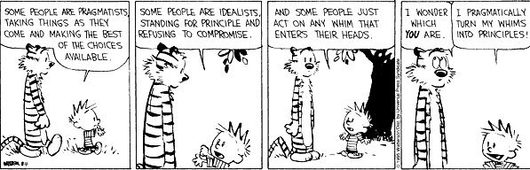

=============================
Life, Universe and Everything
=============================

Life
====

* A little progress everyday ends up in BIG results! 
* Michelangelo decorated a ceiling, but I am sure he had loftier things on his mind.
* "They that can give up essential liberty to obtain a little temporary safety
  deserve neither liberty nor safety." -- Benjamin Franklin, 1759
* Do not confuse "duty" with what other people expect of you; they are utterly
  different. Duty is a debt you owe to yourself to fulfill obligations you have
  assumed voluntarily. Paying that debt can entail anything from years of
  patient work to instant willingness to die.  Difficult it may be, but the
  reward is self-respect.  --Robert A. Heinlein
* In life, after we get past the stage of fear, I think it is a never ending
  stage of adventure.
* "Now, Now", cried the Queen, "Faster,Faster".  - Alice in Wonderland. 
* Half of being smart is knowing what you're dumb at.
* Being entirely honest with oneself is a good exercise. --Sigmund Freud 
* What Linux myths or misconceptions do you find particularly galling?.
  Torvalds responds.

        I don't get upset that easily, so I can't say that there is any in
        particular that I find galling. One myth that I find interesting, but
        which has nothing to do with Linux or even the IT sector in particular,
        is the myth of how a single person or even a single company makes a huge
        difference in the market. It's the belief that things happen because
        somebody was visionary and "planned" it that way. Sometimes the people
        themselves seem to believe it, and then the myth becomes hubris.

        I have to continually try to explain to people that no, I don't
        "control" what happens in Linux. It's about having an environment that
        is conducive to development, not so much about any particular leader.
        And I think that is true in most cases, be it the "great sport coach" or
        the "great spiritual leader."

Universe
========

* Mathematics should be taught as art for art's sake. These mundane "useful"
  aspects would follow naturally as a trivial by-product. Beethovan could
  easily write an advertising jingle, but his motivation for learning music was
  to create something beautiful.

* For indeed, there is nothing in the intellect which was not in the senses,
  except the intellect itself. Music is the pleasure the human mind experiences
  from counting without being aware that it is counting. Nothing exists and
  nothing happens without a reason why it is so, and not otherwise. 
  - Gottfried Leibniz

Everything
==========

* Linux: Because a PC is a terrible thing to waste. (By
  komarimf@craft.camp.clarkson.edu, Mark Komarinski)
* The primary purpose of the DATA statement is to give names to the constants;
  instead of referring to pi as 3.141592653589793 at every appearance, the
  variable pi can be given that value with the DATA statement and used instead
  of the longer form of the constant. This also simplifies modifying the
  program, should the value of PI change. - FORTRAN manual for Xerox Computers.  
* All programmers are playwrights and all computers are lousy actors.
 
* "I could have made money [by joining the proprietary software world],
  and perhaps amused myself writing code. But I knew that at the end of my
  career, I would look back on years of building walls to divide people,
  and feel I had spent my life making the world a worse place." Richard
  Stallman, GNU Project (http://www.gnu.org/gnu/thegnuproject.html).

* Programming is the art of writing essays in crystal clear prose and making
  them executable - Per Brinch Hansen

* You know you have acheived perfection in design, not when you have nothing
  more to add, but when you have nothing more to take away. - Antoine Saint
  Exupery.

* Beg your pardon, Sir, but your excuse, "We've always done it this way,' is
  the most damaging phrase in the language." - Admiral Grace Murray Hooper

---- 

* It's a magical world, Hobbes, ol' buddy... Let's go exploring! 
  --:Calvin and Hobbes
